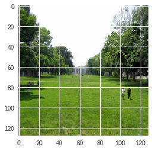
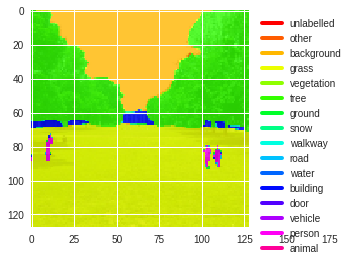

# SUN2012-Python
A Python interface for the [SUN2012](http://groups.csail.mit.edu/vision/SUN/) dataset.

## Dependencies
* Python 3.X
* OpenCV (See installation instructions for [Windows](https://docs.opencv.org/2.4/doc/tutorials/introduction/windows_install/windows_install.html) or [Ubuntu](https://www.pyimagesearch.com/2016/10/24/ubuntu-16-04-how-to-install-opencv/))
* SUN2012 dataset [download](http://groups.csail.mit.edu/vision/SUN/releases/SUN2012.tar.gz)

## Build Instructions
### Windows
    git clone https://github.com/djorna/SUN2012-Python.git
    cd SUN2012-Python
    py -3 -m virtualenv env && env\Scripts\activate # (Optional) create virtual environment
    py -3 -m pip install -r requirements.txt # Install dependencies

### Linux/Ubuntu
    git clone https://github.com/djorna/SUN2012-Python.git
    cd SUN2012-Python
    python3-m virtualenv env && source env/bin/activate # (Optional) create virtual environment
    python3 -m pip install -r requirements.txt # Install dependencies

## Usage
```Python
from dataloader import SUNLoader
from matplotlib import pyplot as plt

# Initialize SUNLoader object. SUN2012.csv contains metadata from the SUN2012 dataset. 
# groups.json specifies which groups to combine to form supergroups. This can be edited
# to meet specific requirements.
sl = SUNLoader(file_csv='data/SUN2012.csv',
               groups_json='data/groups.json')

# Extract the contents of the tar file to some desired location.
sl.load_SUN2012(filepath='/path/to/download/SUN2012.tar.gz', destination='.')

# Show original image
plt.figure()
plt.imshow(img)
sl.visualize(img, id='sun_acifojkymnniakru', alpha = 0.2)
```




